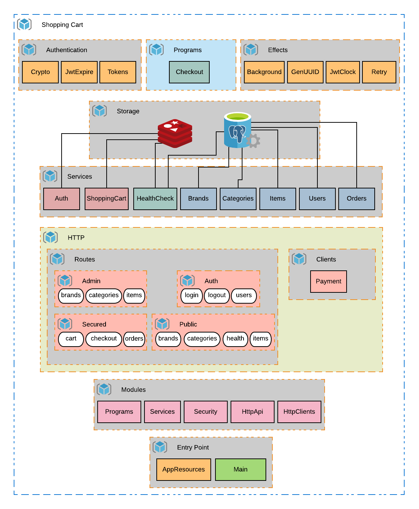

## Components Overview

Here's an overview of the different components that make this application.



- Both **Services** and **Authentication** are *algebras*. The latter are mainly dependencies for some of the services.
- Programs shows **Checkout**, the business logic that combines most of the services.
- Effects show our custom interfaces required implicitly.
- The lines connecting services to Redis and PostgreSQL show which ones access which storage.
- The HTTP layer shows the client and the different routes.
- At the very end, we have both the modules and the entry point to the application.

## Authentication Data

For didactic purposes, this is made available but in a real application **THIS SHOULD NEVER BE MADE PUBLIC**.

For Admin users, the following environment variables are needed:

- `SC_JWT_SECRET_KEY`
- `SC_JWT_CLAIM`
- `SC_ADMIN_USER_TOKEN`

For access token (manipulation of the shopping cart):

- `SC_ACCESS_TOKEN_SECRET_KEY`

For password encryption:

- `SC_PASSWORD_SALT`

See the files [docker-compose.yml](app/docker-compose.yml) or [.env](./.env) for more details.

### Generate your own auth data

In order to generate a valid JWT token, you need a *secret key*, which can be any String, and a *JWT Claim*, which can be any valid JSON. You can then generate a token, as shown below:

```scala
val claim = JwtClaim(
  """
    {"uuid": "6290c116-4153-11ea-b77f-2e728ce88125"}
  """
)

val secretKey = JwtSecretKey("any-secret")

val algo = JwtAlgorithm.HS256

val mkToken: IO[JwtToken] =
  jwtEncode[IO](claim, secretKey, algo)
```

In our case, our claim contains a UUID, which is used to identify the Admin Id. In practice, though, a JWT can be any valid JSON.

Take a look at the [TokenGenerator program](https://github.com/gvolpe/pfps-shopping-cart/tree/master/modules/core/src/main/scala/tokens/generator.scala) to learn more.

## Tests

To run Unit Tests:

```
sbt test
```

To run Integration Tests we need to run both `PostgreSQL` and `Redis`:

```
docker-compose up
sbt it:test
docker-compose down
```

### Access Redis & Postgres

We can interact with both servers directly using the following commands:

```
$ docker-compose exec Redis /usr/local/bin/redis-cli
$ docker-compose exec Postgres usr/local/bin/psql -d store -U postgres
```

## Build Docker image

```
sbt docker:publishLocal
```

Our image should now be built. We can check it by running the following command:

```
> docker images | grep shopping-cart
REPOSITORY                    TAG                 IMAGE ID            CREATED             SIZE
shopping-cart                 latest              646501a87362        2 seconds ago       138MB
```

To run our application using our Docker image, run the following command:

```
cd /app
docker-compose up
```

## Payments Client

The configured test payment client is a fake API that always returns 200 with a Payment Id. Users are encouraged to make modifications, e.g. return 409 with another Payment Id (you can create one [here](https://www.uuidgenerator.net/api/version1/1)) or any other HTTP status to see how our application handles the different cases.

This fake API can be modified at: [https://beeceptor.com/console/payments](https://beeceptor.com/console/payments)

## HTTP API Resources

If you use the [Insomnia](https://insomnia.rest/) REST Client, you can import the shopping cart resources using the [insomnia.json](insomnia.json) file.
